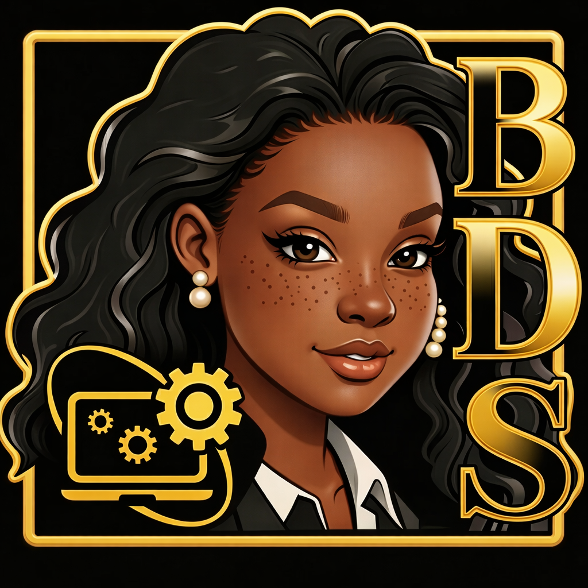

# Bria✨Dev✨Success   (BDS)

<p align="center" style="margin: 16px 0 24px 0;">
  
</p>

🌐 **Site web dédié aux personnes en reconversion professionnelle dans le digital**

## 🇫🇷 Présentation

**BRIA DEV SUCCESS (BDS)** est une plateforme web évolutive pensée pour accompagner les personnes en reconversion professionnelle vers les métiers du numérique.

🌍 Site en ligne : [https://www.briadev.com/](https://www.briadev.com/)

Objectifs principaux :

* Donner de la **visibilité** aux parcours de reconversion
* Mettre en avant les **compétences digitales**
* Centraliser des **ressources utiles**
* Inspirer et rassurer celles et ceux qui souhaitent changer de carrière

Le site est conçu pour être **évolutif, interactif et accessible**, avec une vision à long terme orientée communauté et progression professionnelle.

## 🛠️ Technologies utilisées

* **React 18** - Framework frontend moderne
* **Vite** - Outil de build ultra-rapide
* **JavaScript ES6+** - Langage de programmation
* **CSS-in-JS** - Styling avec JavaScript
* **Bootstrap Grid** - Système de grille responsive

## 📁 Structure du projet

```
├── src/
│   ├── components/           # Composants React
│   │   ├── Navbar.jsx       # Navigation principale
│   │   ├── Hero.jsx         # Section héros avec animation
│   │   ├── About.jsx        # Section à propos
│   │   ├── TechStack.jsx    # Technologies maîtrisées
│   │   ├── CareerPaths.jsx  # Métiers IT interactif
│   │   ├── Roadmaps.jsx     # Roadmaps de formation
│   │   ├── Projects.jsx     # Portfolio projets
│   │   └── Contact.jsx      # Section contact
│   ├── styles/
│   │   └── responsive.css   # Styles responsive
│   ├── App.jsx              # Composant principal
│   └── main.jsx             # Point d'entrée
├── public/
│   └── images/              # Images et assets
├── package.json             # Dépendances npm
├── vite.config.js          # Configuration Vite
└── vercel.json             # Configuration déploiement

## 🚀 Installation et développement

```bash
# Installation des dépendances
npm install

# Démarrage du serveur de développement
npm run dev

# Build pour la production
npm run build

# Prévisualisation du build
npm run preview
```

## 🌍 English Version

## 🇬🇧 Overview

**Bria Dev Success (BDS)** is an evolving web platform designed to support people transitioning into digital careers.

🌍 Live website: [https://www.briadev.com/](https://www.briadev.com/)

Main goals:

* Highlight **career transition journeys**
* Showcase **digital skills**
* Share **useful resources**
* Inspire and reassure people changing careers

The website is designed to be **evolving, interactive, and accessible**, with a long-term vision focused on community and career growth.

## 🛠️ Tech Stack

* **React 18** - Modern frontend framework
* **Vite** - Ultra-fast build tool
* **JavaScript ES6+** - Programming language
* **CSS-in-JS** - JavaScript styling
* **Bootstrap Grid** - Responsive grid system

## 📄 Project Structure

```
├── src/
│   ├── components/           # React components
│   │   ├── Navbar.jsx       # Main navigation
│   │   ├── Hero.jsx         # Hero section with animation
│   │   ├── About.jsx        # About section
│   │   ├── TechStack.jsx    # Mastered technologies
│   │   ├── CareerPaths.jsx  # Interactive IT careers
│   │   ├── Roadmaps.jsx     # Learning roadmaps
│   │   ├── Projects.jsx     # Portfolio projects
│   │   └── Contact.jsx      # Contact section
│   ├── styles/
│   │   └── responsive.css   # Responsive styles
│   ├── App.jsx              # Main component
│   └── main.jsx             # Entry point
├── public/
│   └── images/              # Images and assets
├── package.json             # npm dependencies
├── vite.config.js          # Vite configuration
└── vercel.json             # Deployment configuration
```

## 🚀 Installation & Development

```bash
# Install dependencies
npm install

# Start development server
npm run dev

# Build for production
npm run build

# Preview build
npm run preview
```

✨ *Projet conçu avec bienveillance pour accompagner les reconversions professionnelles dans le digital.*
